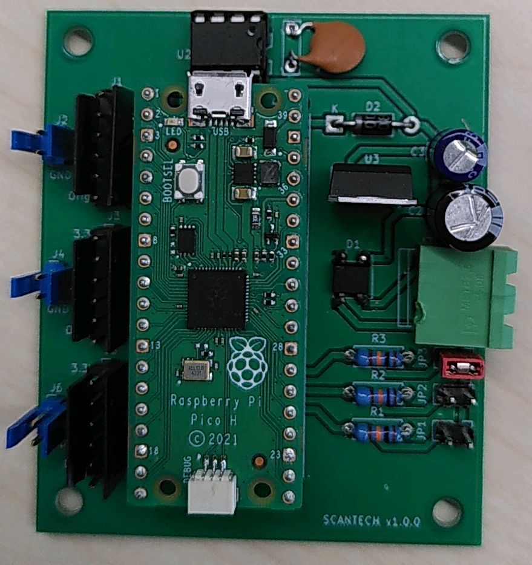

Motordriver board
=================

This is a simple Kicad project for driver 3 stepper motors with a Raspberry Pico.

The project contains 2 boards:
 - "Carte Mere" where a Raspberry Pico must be plugged.
 - "Carte Driver" where the motor driver must be plugged.

1) The "Carte Mere":
It should be connected to a 24V DC alimentation, and produces 5V DC for the Raspberry Pico.

An I2C memory Flash may be added to store configuration of the Raspberry Pico.

3 jumpers help to define the "Carte Driver" connected to it.

2) The "Carte Driver":
It should be connected to the "Carte Mere" with two cables:
 - 5 wires for commands
 - 2 wires for 24V DC input

It carries a TMC2209 motor driver but it should accept other standard motor driver.

A endstop may be plugged to the board.

3) Usage:
The Raspberry Pico manages 3 stepper motors with the step/direction entries.

Stepper 1 connection:

 - 3.3 VDC
 - GND
 - Enab : GP 2
 - Step : GP 3
 - Dir  : GP 4
 - Orig : GP 5

Stepper 2 connection:

 - 3.3 VDC
 - GND
 - Enab : GP 6
 - Step : GP 7
 - Dir  : GP 8
 - Orig : GP 9

Stepper 3 connection:

 - 3.3 VDC
 - GND
 - Enab : GP 10
 - Step : GP 11
 - Dir  : GP 12
 - Orig : GP 13

Jumpers configuration:

 - JP1 : GP 18
 - JP2 : GP 19
 - JP3 : GP 20

I2C memory flash:

 - sda : GP0
 - scl : GP1

4) Software
The project may run with the project:

https://github.com/mchalain/stepperdriver

